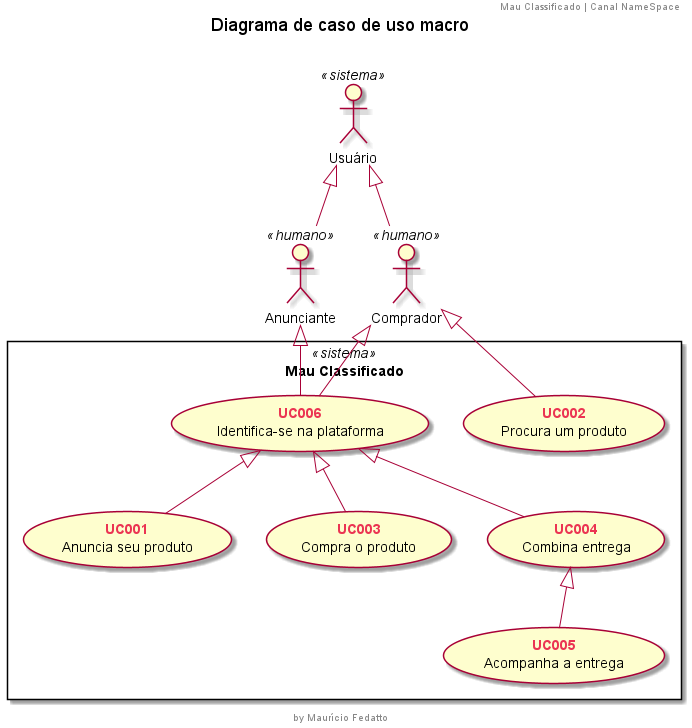

# Mau Classificado

## Diagrama de caso de uso macro

### Ator Usuário

Mussum Ipsum, cacilds vidis litro abertis. Em pé sem cair, deitado sem dormir, sentado sem cochilar e fazendo pose. Tá deprimidis, eu conheço uma cachacis que pode alegrar sua vidis. Todo mundo vê os porris que eu tomo, mas ninguém vê os tombis que eu levo! Praesent malesuada urna nisi, quis volutpat erat hendrerit non. Nam vulputate dapibus.

### Ator Anunciante

Mussum Ipsum, cacilds vidis litro abertis. Em pé sem cair, deitado sem dormir, sentado sem cochilar e fazendo pose. Tá deprimidis, eu conheço uma cachacis que pode alegrar sua vidis. Todo mundo vê os porris que eu tomo, mas ninguém vê os tombis que eu levo! Praesent malesuada urna nisi, quis volutpat erat hendrerit non. Nam vulputate dapibus.

### Ator Comprador

Mussum Ipsum, cacilds vidis litro abertis. Em pé sem cair, deitado sem dormir, sentado sem cochilar e fazendo pose. Tá deprimidis, eu conheço uma cachacis que pode alegrar sua vidis. Todo mundo vê os porris que eu tomo, mas ninguém vê os tombis que eu levo! Praesent malesuada urna nisi, quis volutpat erat hendrerit non. Nam vulputate dapibus.

### UC001

Mussum Ipsum, cacilds vidis litro abertis. Em pé sem cair, deitado sem dormir, sentado sem cochilar e fazendo pose. Tá deprimidis, eu conheço uma cachacis que pode alegrar sua vidis. Todo mundo vê os porris que eu tomo, mas ninguém vê os tombis que eu levo! Praesent malesuada urna nisi, quis volutpat erat hendrerit non. Nam vulputate dapibus.
